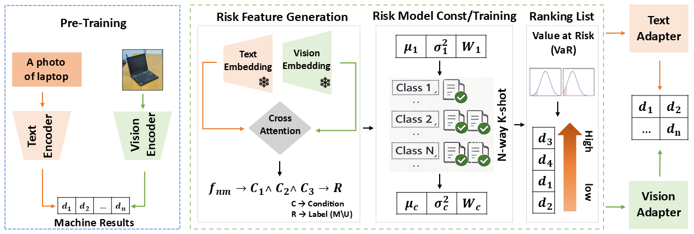

# Risk-Based Domain Adaptation for Small-Scale Vision–Language Learning

This project contains the code for our work titled **"Risk-Based Domain Adaptation for Small-Scale Vision–Language Learning."** 


## Overall Framework
The overall framework of our work is shown below:




## Installation
Install the required packages listed in `Requirements.txt`.

## Usage
```bash
PrepareRiskData
OneSidedRules
Common
python Main.py
